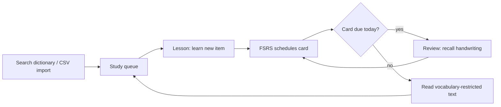
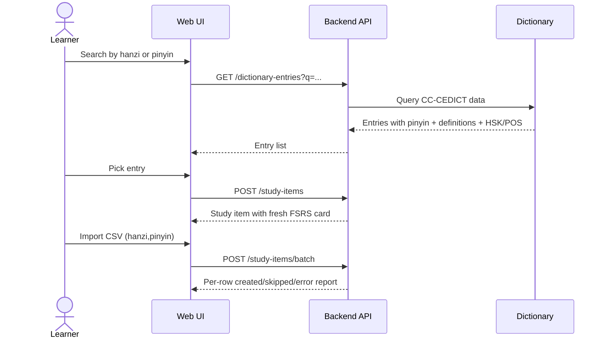
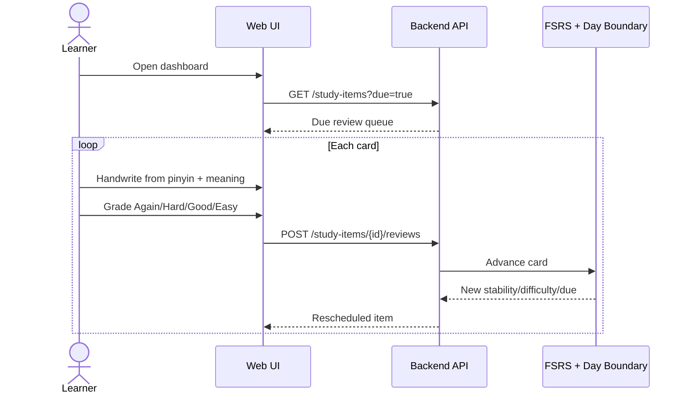
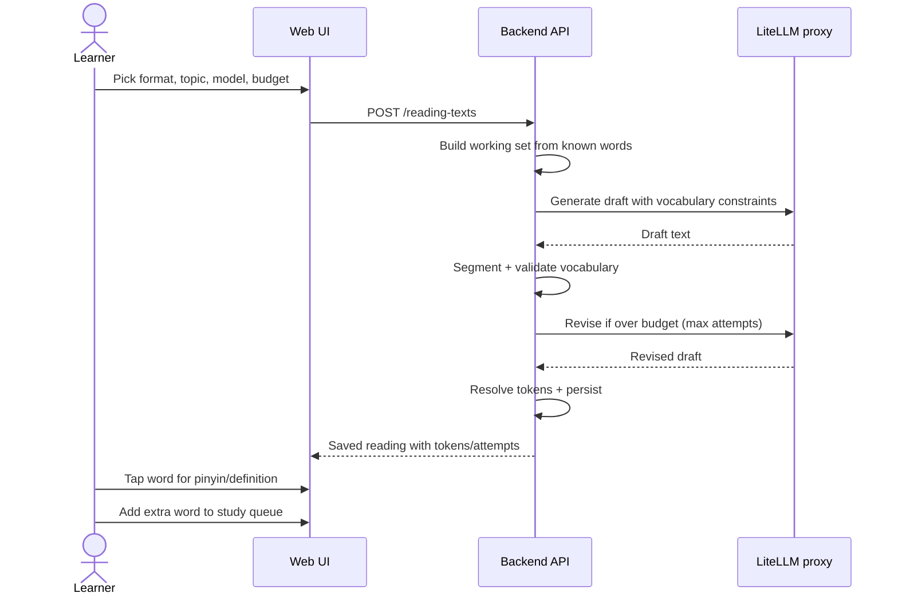

# Business Overview

## What shougong does

`shougong` (手工, "handwork") is a web application that trains learners to
**hand-write simplified Chinese characters**. It combines three study loops:

1. **Queue management**: search a bundled dictionary (CC-CEDICT) or import a CSV
   and enqueue entries as study items.
2. **Spaced repetition**: each item is scheduled with FSRS, a modern
   spaced-repetition algorithm. New items are learned in a lesson session, then
   become review cards that come due on a daily boundary.
3. **Contextual reading**: the app asks an LLM to generate Mandarin texts that
   are restricted to the learner's known vocabulary, so reading practice always
   stays inside the words the learner is studying.

Supporting capabilities make the loops usable:

- Per-character stroke-order data, fetched lazily from the Hanzi Writer source
  and cached in MySQL.
- Dictionary metadata (HSK 3.0 level and part-of-speech tags) used to estimate
  proficiency and build balanced working sets for reading generation.
- Vocabulary and topic management so reading practice can be customized.
- An append-only history trail for every study item, enabling progress charts
  and analytics.

## Why this product matters

Reading and writing Chinese are different skills. A learner can recognize a
character but fail to recall its stroke order under pressure. Shougong treats
handwriting as a recall task, not a recognition task, and schedules that recall
with FSRS so effort is spent on cards that are about to be forgotten.

The reading generator closes the loop between vocabulary and use: every text is
built almost entirely from words the learner already studies, so reading
practice reinforces active vocabulary instead of frustrating the learner with
unknown words.

## Core workflows

### 1. Onboarding words

### 2. Daily study loop

### 3. Reading practice

## Personas

| Persona | Goal | Typical session |
| --- | --- | --- |
| **Beginning self-learner** | Build a handwriting habit from zero | Adds a few HSK 1-2 words, learns them, reviews due cards, reads one short text |
| **Continuing learner** | Keep vocabulary sharp without planning effort | Opens the app once a day, does the due queue, spends remaining time on reading or stroke drills |
| **Classroom / tutor** | Track progress and assign practice | Reviews vocabulary breakdown, HSK coverage, learning-to-review history, and reading history; imports word lists |
| **Power user** | High volume, data-driven practice | Uses CSV import, batch review, keyboard shortcuts, filters by HSK/POS, studies item-level FSRS curves |

## Business goals and hypotheses

- **Retention**: a daily review queue that fits in one sitting increases habit
  formation. The day-boundary scheduler makes a whole day's cards due at once,
  encouraging a single predictable session.
- **Comprehensible input**: reading practice is only valuable when the learner
  understands almost all of it. The extra-word ceiling and vocabulary
  restriction are the quality controls for this hypothesis.
- **Efficiency**: FSRS estimates memory stability and difficulty so review
  effort concentrates where forgetting is most likely.
- **Transparency**: learners should see why a card is scheduled when it is.
  Item history and FSRS curves make the algorithm legible.

## Success metrics

| Metric | Source |
| --- | --- |
| Cards added / daily active users | `study_item.created_at`, review activity |
| Reviews per day and per item | `review_log` |
| Learning-to-review graduation rate | `study_item_history` transition rows |
| FSRS stability distribution | `study_item.card_stability` |
| HSK coverage and estimated level | `reading-vocabulary` summary |
| Reading generations, attempts, and extra-word violations | `reading_text.attempts` |
| AI cost per reading | `prompt_tokens + completion_tokens` in `reading_text` |

## Product constraints and decisions

- **Simplified Chinese only**: traditional forms are intentionally dropped at
  dictionary import time.
- **Handwriting-first**: the review flow is inverted; the learner writes from
  pinyin + meaning and only then sees the character.
- **Portuguese-first UI**: current interface copy is pt-BR, though the backend
  domain language stays English.
- **No user accounts yet**: the current data model is single-learner. Multi-user
  support would require adding ownership to every aggregate.
- **AI is self-hosted through LiteLLM**: the app calls an OpenAI-compatible
  proxy; the model is chosen per request and cost is controlled by token
  budgets and a correction-loop cap.
- **No mnemonics or component decomposition yet**: these are planned future
  features, not part of the current API or schema.
