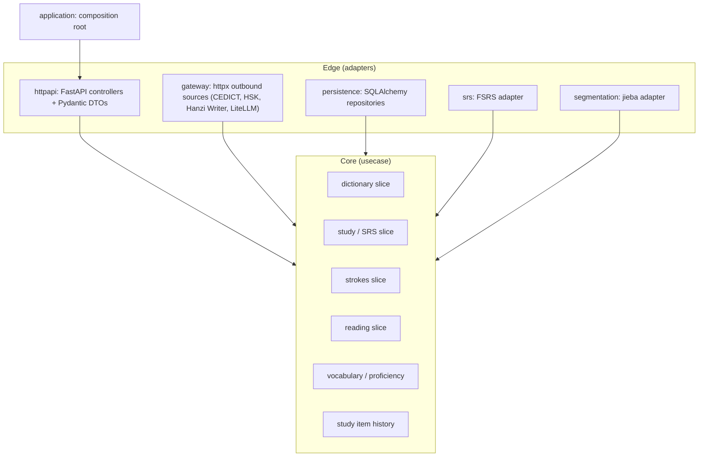
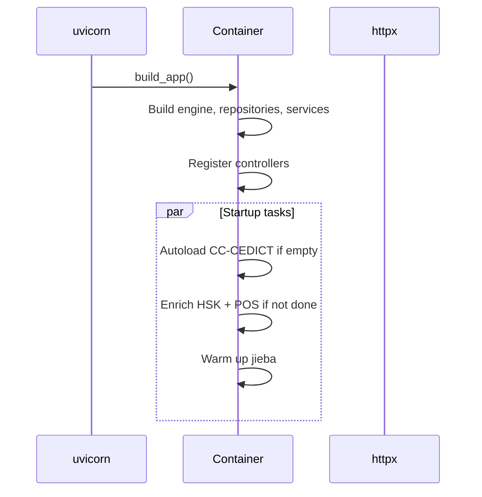
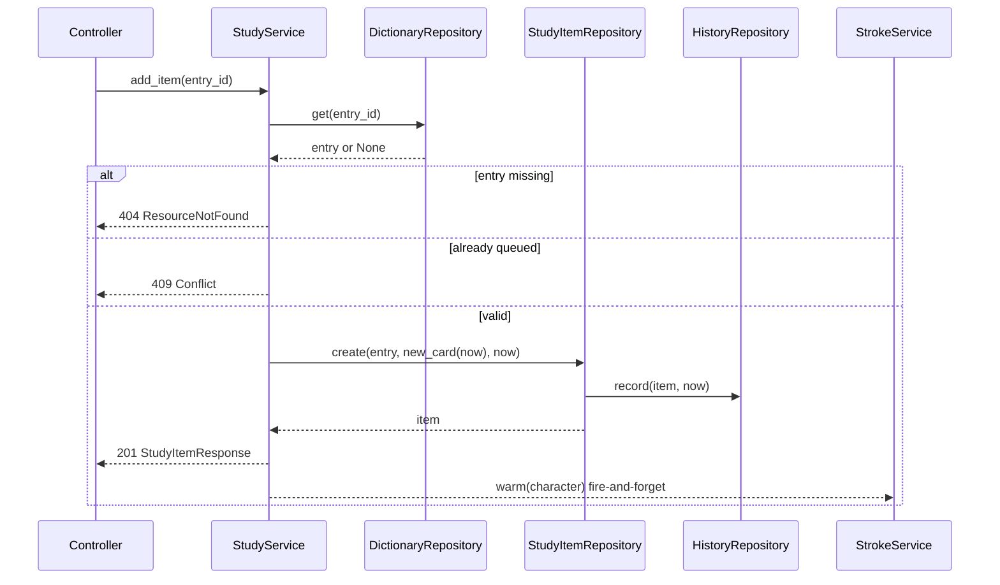
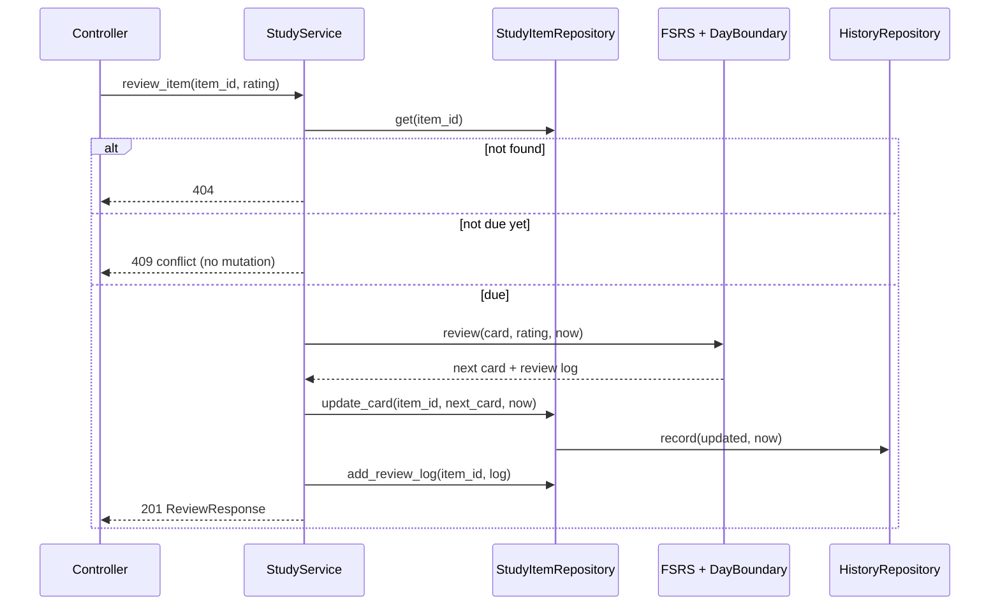
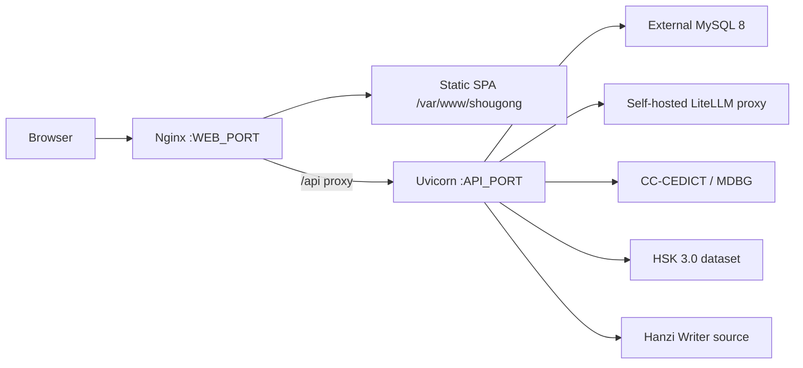

# Technical Architecture

## Stack

- **Backend**: Python 3.12, FastAPI, SQLAlchemy 2 async, asyncmy, MySQL 8,
  FSRS (`py-fsrs`), jieba, Alembic, httpx, structlog, pydantic-settings.
- **Frontend**: React 19, Vite, TypeScript, Tailwind CSS v4, TanStack Query,
  react-router, hanzi-writer.
- **Deployment**: one Docker image with supervisord running uvicorn + nginx;
  external MySQL; external LiteLLM proxy for AI.

## Hexagonal layering

The backend follows a layered hexagonal architecture. Dependencies point inward
and are enforced by import-linter in CI.

Rules that keep the architecture honest:

- `usecase/` contains frozen dataclasses, `typing.Protocol` ports (`I*`), and
  services. It must never import `fastapi`, `sqlalchemy`, `httpx`, `pydantic`,
  `uvicorn`, `fsrs`, or `jieba`.
- Pydantic DTOs live only in `httpapi/schema.py`; `application/settings.py`
  uses `pydantic-settings` for configuration.
- The composition root (`application/container.py`) knows every concrete class
  and wires the object graph; tests build their own containers with fakes.
- Adapters explicitly inherit their port interfaces so the IDE and mypy can
  jump between contract and implementation.

## Component inventory

| Slice | Domain | Ports | Adapters |
| --- | --- | --- | --- |
| Dictionary | CC-CEDICT entries, HSK metadata | `IDictionaryRepository`, `ICedictSource`, `IHskDatasetSource` | SQLAlchemy repo, MDBG/CC-CEDICT fetcher, HSK dataset fetcher |
| Study | study items, batch import, review loop | `IStudyItemRepository` | SQLAlchemy repo + history repo |
| SRS | FSRS card model and rating | `ISrsEngine` | `DayBoundaryEngine` + `FsrsEngine` |
| Strokes | per-character stroke order | `IStrokeRepository`, `IHanziStrokeSource` | SQLAlchemy cache, Hanzi Writer source |
| Reading | generation, working sets, topics, word usage | `IReadingTextGateway`, `ISegmenter`, `IReadingHistoryRepository`, `IReadingTopicRepository`, `IReadingWordUsageRepository` | LiteLLM gateway, jieba segmenter, SQLAlchemy repos |
| Vocabulary | grammatical overview and proficiency | `IStudyItemRepository`, `IDictionaryRepository` | derived on read, not persisted |
| Health | liveness/readiness | `IHealthChecker` | MySQL check, self-HTTP check |

## Startup and background work

Dictionary population is fire-and-forget: the API serves immediately and search
results appear once the background pass finishes. Both autoload passes are
idempotent and guarded by table state (`count() == 0` for CEDICT, any row with
`hsk_level` for enrichment).

## Key request flows

### Add a study item

### Grade a review

## Deployment topology

- One image (`Dockerfile`) builds the SPA, resolves backend deps, then ships
  both processes under supervisord.
- `deploy/entrypoint.sh` renders the nginx config from a template, applies
  Alembic migrations, then starts supervisord. A failed migration aborts boot.
- The API is exposed directly on `API_PORT` (8080) and through nginx on
  `WEB_PORT` (8081) at `/api`.
- CI (`backend` + `frontend` jobs) gates the Docker publish job, which only runs
  on `master` pushes and pushes `luiznaac/shougong:latest` + `:v<run-number>`.

## Configuration

All configuration is environment-based (`pydantic-settings`); nested keys use
`__`:

| Variable | Default | Meaning |
| --- | --- | --- |
| `APP_ENV` | `dev` | Controls JSON logging |
| `HTTP_PORT` | `8080` | uvicorn port |
| `MYSQL__*` | localhost | Database connection |
| `DICTIONARY_AUTOLOAD` | `true` | Fill CEDICT on boot if empty |
| `HSK_ENRICH_AUTOLOAD` | `true` | Stamp HSK/POS on boot if missing |
| `STUDY_TIMEZONE` | `UTC` | IANA timezone for the SRS day boundary |
| `GATEWAYS__APP__HOST` | `http://localhost:8080` | Self health-check base URL |
| `GATEWAYS__AI__BASE_URL` | `http://localhost:4000` | LiteLLM proxy |
| `GATEWAYS__AI__API_KEY` | `""` | LiteLLM auth |

## Quality gates

- Ruff lint + format (line length 120).
- mypy `--strict`.
- import-linter for architecture contracts.
- pytest: unit tests (no Docker) + integration tests (Testcontainers MySQL).
- Alembic `compare_metadata` guard in integration tests keeps entities and
  migrations in sync.
- Frontend `tsc -b` + Vite production build.

## Cross-cutting contract

`frontend/src/api/types.ts` is a hand-maintained mirror of
`backend/src/shougong/httpapi/schema.py`. Every DTO change must update both
sides in the same commit; this is the reason both projects live in one monorepo.
