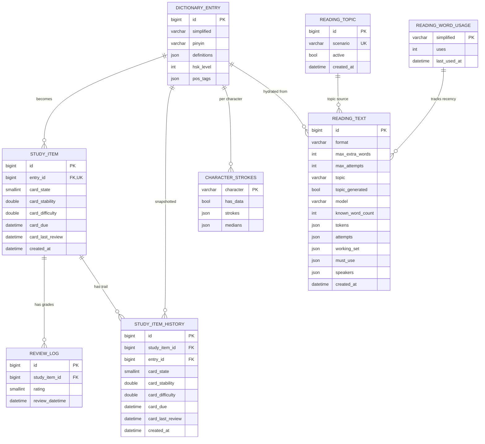
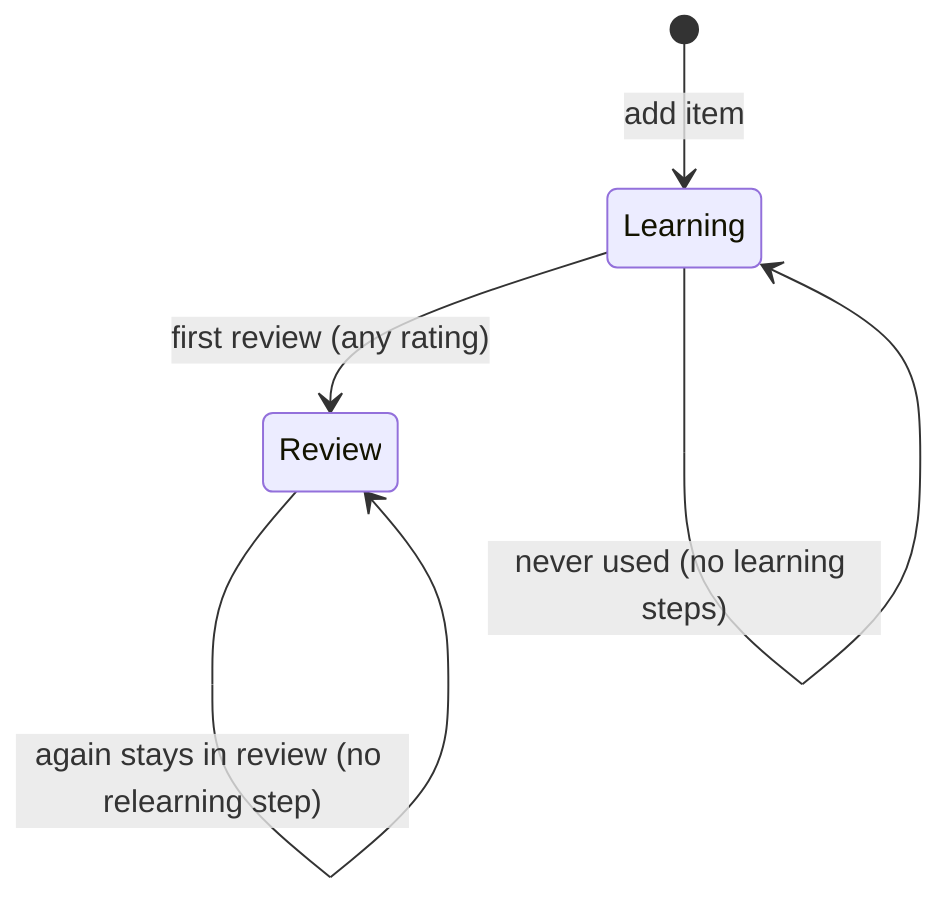

# Data Model

## Entity relationship diagram

> Some edges are conceptual, not foreign keys: `reading_text` references
> `reading_topic` by topic text, `reading_word_usage` is keyed by simplified
> word text, and `character_strokes` is keyed by character. The hard FKs are
> `study_item -> dictionary_entry`, `review_log/study_item_history ->
> study_item`, and `study_item_history -> dictionary_entry`.

## Tables

### `dictionary_entry`

Bundled lexicon, populated from CC-CEDICT and enriched with HSK 3.0 level + POS
tags. Simplified only; traditional forms are dropped.

- `simplified` and `pinyin` are indexed for search and exact matching.
- `pinyin` is normalized at import: lowercase, `ü` written as `v`
  (`lv4 xing2`).
- `hsk_level`/`pos_tags` are stamped once; the same values apply to every row
  sharing a `simplified`.
- A hanzi can have several rows (multiple readings); each is a distinct entry.

### `study_item`

One row per dictionary entry the learner has queued; unique on `entry_id`.
The FSRS card is flattened into `card_*` columns. `card_due` is indexed for
"what is due now".

- `card_state`: `1=Learning`, `2=Review`, `3=Relearning`.
- `card_stability` (days) and `card_difficulty` are FSRS parameters.
- Due times are stored as naive UTC and snapped to the configured timezone's
  midnight by `DayBoundaryEngine`.

### `review_log`

Append-only grade history: `again | hard | good | easy` mapped to smallints.
Newest first when read back.

### `study_item_history`

Append-only snapshot trail of a study item's card state, written on creation and
after every change. Powers item-level charts and the global
learning-to-review transition list.

### `character_strokes`

Per-character cache of Hanzi Writer stroke paths. `has_data=false` rows are a
negative cache so a missing character is not repeatedly fetched upstream.

### `reading_text`

One row per generated reading. Stores the fully resolved token stream, the
generation attempt trail, the offered working set, must-use anchors, dialogue
speakers, and token usage. Saved text is immutable history; hydration against
the current dictionary only happens on list responses.

### `reading_topic`

Curated scenario pool drawn when the user leaves the topic blank. `active=0`
keeps a scenario in the list but out of the draw. Migration `0003` seeds 36
starter scenarios.

### `reading_word_usage`

Per-word use counters (`uses`, `last_used_at`) that feed the recency-biased
sampling of the working set. Dialogue speakers are tracked under a
`speaker:` key prefix to avoid colliding with vocabulary.

## FSRS scheduling model

The backend wraps `py-fsrs` at the `srs/` boundary and mirrors its card/rating
shapes in `usecase/srs/model.py`.

Design choices:

- **No learning or relearning steps**: the first review schedules days out, and
  an "again" in Review keeps the card in Review instead of dropping it to a
  relearning sub-state.
- **Day boundary**: every `due` is rounded down to midnight in
  `STUDY_TIMEZONE`, so a whole day's cards become due at once. This favors a
  once-a-day habit over per-hour precision.
- **Conflict rule**: grading a card before its `due` returns `409` and writes
  nothing, so a double-submit can never advance a card twice.

## Time handling

- Domain times are timezone-aware UTC; persistence strips `tzinfo` because MySQL
  has no timezone.
- All "now" reads go through `IClock` so tests can freeze time.
- Date rendering in the UI converts back to the learner's local timezone.
