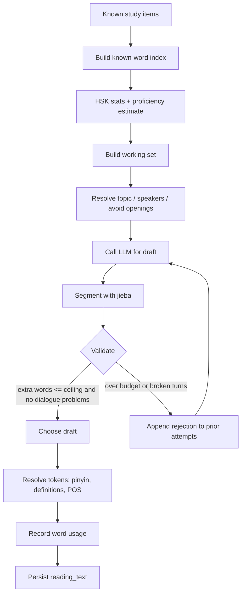

# Reading Engine

## Purpose

The reading engine turns the learner's known vocabulary into Mandarin reading
practice. An LLM produces the running text; everything that decides what is
"known" stays local. The model never supplies translations, pinyin, or
definitions, and never decides whether a word is in scope.

The product goal is **comprehensible input**: a text the learner can actually
read, with a small number of new words as a controlled challenge.

## Generation pipeline

## Inputs

### Known vocabulary

- Every `study_item` joined to `dictionary_entry` is "known", deduplicated by
  simplified form.
- A word is known as a whole string. Knowing `人` and `工` does not make `人工`
  known; the validator re-scans hanzi runs with greedy longest-match so real
  compounds surface whole.

### Working set

The model receives a **working set**, not the whole vocabulary:

- Function-word floor (`always_available`): a fixed grammatical core (的, 了,
  是, 在, 不, 吗, ...) the learner knows, plus a coverage-weighted sample of
  their other function words per HSK level.
- Content groups with quotas: verbs 12, nouns 12, people 5, places 4,
  descriptions 5, time 4, quantity 4, connectives 4, adverbs 4, other 3.
- Must-use anchors: 6 words sampled from the working set, biased toward verbs
  and nouns, which the text must contain.
- If the learner has fewer than 30 categorised content words, the fallback is a
  flat sorted list of all known words.

### Recency bias

`reading_word_usage` records how often and how recently each word appeared.
Sampling weight increases for words used less often and longer ago, so
successive texts rotate vocabulary and implicitly re-read old words.

### Topic resolution

- A non-empty user topic is used verbatim.
- A blank topic draws from active `reading_topic` scenarios, skipping the 12
  most recent topics; if none exist it falls back to "free choice, something
  everyday".
- The last 8 readings' openings are passed as `avoid_openings` so successive
  texts do not start the same way.

### Dialogue speakers

- If the learner knows at least two role words (哥哥, 老师, ...), the engine
  prefers known role pairs so vocabulary is reinforced.
- Otherwise it combines surnames/given names from a fixed whitelist and shows
  pinyin on first use. Speaker names are outside the extra-word budget.

## Validation and correction loop

Each request allows `max_attempts` (1-6, default 3) model calls. After every
draft:

1. jieba segments the text and assigns POS tags.
2. The validator checks distinct words against the known set and computes
   out-of-vocabulary extras.
3. Dialogue drafts are checked for: missing `lines`, unknown speakers, fewer
   than two speakers, consecutive same-speaker turns, and turns missing from
   the running text.
4. If extras exceed `max_extra_words` or any dialogue problem exists, the exact
   rejected words/problems are fed back and the model is asked to rewrite.
5. The chosen draft is the first one inside the budget with no problems; if
   none exists, the least-bad one wins (no dialogue problems first, then fewest
   extras, then most recent).

Every draft is persisted in `attempts` with its segmentation, flagged extras,
token usage, and `chosen` flag, giving an auditable generation trail.

## Budget policy

The prompt varies by proficiency:

- **Beginner**: spend the extra-word budget on grammatical particles the text
  cannot work without.
- **Intermediate**: spend it on one concrete content word that makes the text
  worth reading.

The maximum output is capped at 1200 tokens per call, and `max_attempts` caps
the worst-case spend. Token usage is returned and stored so the UI and operator
can see generation cost.

## Post-processing and persistence

The chosen draft is resolved into tokens:

- Chinese words get pinyin, definitions, POS, `is_extra`, and
  `dictionary_entry_id` from the dictionary (preferring the studied reading).
- Punctuation/whitespace passes through.
- Dialogue tokens are grouped into turns with speaker attribution.
- Word usage counters are bumped for known words that appeared, and speaker
  usage is recorded under `speaker:` keys.

The saved `reading_text` stores the fully resolved token stream as immutable
history. On list reads the service re-hydrates pinyin/definitions/entry ids
from the current dictionary and study queue, so the displayed text always
matches the current lexicon.

## Quality outcomes

- **Vocabulary control**: `max_extra_words` is a hard ceiling on distinct words
  outside known vocabulary; repetition of an allowed extra word is free.
- **Grammar exposure**: the fixed function-word floor guarantees the learner
  sees the grammar they have (questions, negation, connectives).
- **Diversity**: recency sampling, must-use anchors, topic rotation, and
  opening avoidance keep consecutive texts from repeating themselves.
- **Cost transparency**: token usage per attempt, per reading, and total is
  available in the API response.
