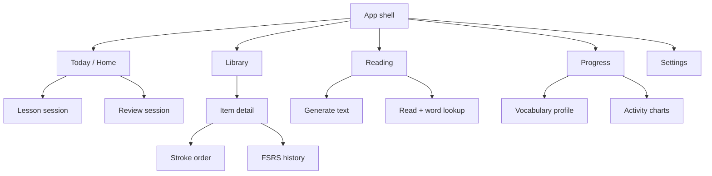
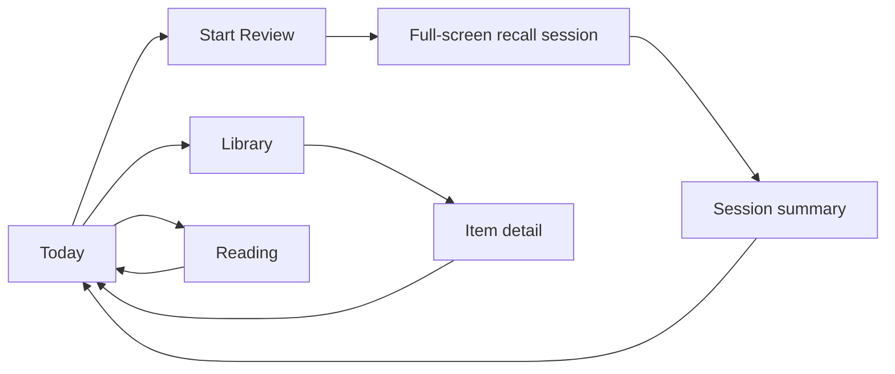
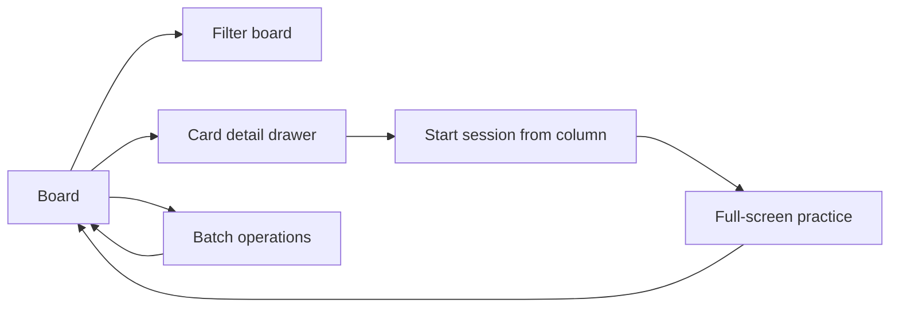
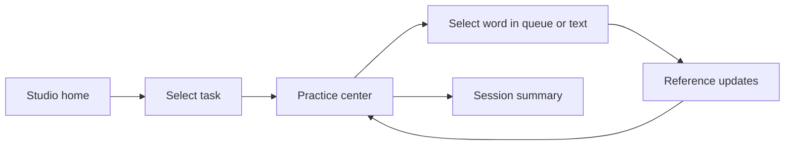

# UI / UX Proposal - Desktop Web Interfaces

## Scope

This document deliberately **ignores the current React implementation** and
considers only the stack: the backend API capabilities, the frontend toolkit
(React + Vite + TypeScript + Tailwind + hanzi-writer), and the data model. It
proposes desktop-first web interfaces, no mobile.

The goal is to make the three study loops (add/import, lesson/review, reading)
feel like one coherent workflow: a learner should know what to do now, why a
card is scheduled, and how to move between practice and reference without losing
context.

## Design principles

1. **Today first.** The primary surface answers "what should I study right now"
   with one obvious action, not a wall of widgets.
2. **Progressive disclosure.** Advanced details (FSRS curves, generation
   attempts, working sets, CSV diagnostics) live behind expandable sections,
   drawers, or item pages, not in the first viewport.
3. **Context preservation.** Clicking a word in a reading or a tile on the board
   should never destroy the current session; use side panels and overlay
   drawers for drill-downs.
4. **Keyboard-first practice.** Handwriting recall benefits from full-screen
   focus with predictable keys: grade 1-4, space/enter to advance, `z`/backspace
   to undo, `esc` to exit. Key hints are visible but quiet.
5. **Legible scheduling.** Surface FSRS state as plain language: "New",
   "Learning", "Due today", "Next due in 4 days", plus stability/difficulty in
   an item detail view. Color encodes level, never information on its own.
6. **No decorative density.** Use tables, dense lists, and focused panels for
   operational views; reserve expressive layout for the practice screens where
   the hanzi needs room.
7. **Empty states are guidance.** A new learner sees a clear "add your first
   words" path; a finished session sees a calm completion summary, not a blank
   screen.

## Information architecture

Recommended desktop IA, shared by all options:



Global navigation lives in a persistent top bar or left rail (desktop): brand,
primary actions ("Start review", "New lesson", "Generate reading"), module
navigation, and session status. Keyboard shortcuts are consistent across
modules.

## Option A - Study Command Center (recommended)

A calm, daily-loop hub. The first screen is a single "Do this now" surface: one
large start button for whatever is due, a compact queue, and progress context
around it. This is the strongest default for the single-learner workflow.

### Layout

```text
┌────────────────────────────────────────────────────────────────────────────┐
│ Logo   Today   Library   Reading   Progress          [Search]  [Settings] │
├────────────────────────────────────────────────────────────────────────────┤
│                                                                             │
│  Today, Thu 11 Sep                                    ┌─────────────────┐ │
│  ┌──────────────────────────────────────────────┐    │ SRS Ladder       │ │
│  │  24 due  |  3 new  |  1 reading suggestion   │    │ New       3      │ │
│  │                                             │    │ Learning  6      │ │
│  │            [ Start Review -> ]              │    │ Review   15      │ │
│  │            [ Learn 3 new    ]               │    │ Master    0      │ │
│  │            [ Read a text    ]               │    │                 │ │
│  └──────────────────────────────────────────────┘    └─────────────────┘ │
│                                                                             │
│  Due next 7 days                                    Progress              │
│  [Mon 12: 8] [Tue 13: 6] [Wed 14: 4] ...           [stability chart]     │
│                                                                             │
│  Quick queue                                       Reading                 │
│  [学 due today] [习 due today] [你好 new] ...      [last generated text]  │
└────────────────────────────────────────────────────────────────────────────┘
```

### Key screens

| Screen | Behavior |
| --- | --- |
| Today | Hero action buttons with counts; due calendar strip; quick queue; SRS ladder summary |
| Library | Searchable table of all study items with state, HSK, due date; row click opens item detail |
| Item detail | Hanzi, pinyin, meanings, stroke order player, FSRS facts, trajectory chart, related entries |
| Lesson / Review | Full-screen focus session (see interaction patterns) |
| Reading | Generator form + reading surface + history |
| Progress | HSK coverage, vocabulary profile, learning-to-review curve, review accuracy |

### Flow



**Strengths**: lowest cognitive load, strongest habit loop, easy to learn.
**Tradeoff**: less useful for power users who want batch operations and filters
on the first screen.

## Option B - SRS Pipeline Board

A visual kanban/board view of the SRS pipeline. Cards move New -> Learning ->
Review as they graduate; the board is the primary surface and practice starts
from any column. Modeled after WaniKani/HanziHero ladders but optimized for
desktop density and batch management.

### Layout

```text
┌────────────────────────────────────────────────────────────────────────────┐
│ Logo   Today   Library   Reading   Progress          [Filter]  [Settings] │
├────────────────────────────────────────────────────────────────────────────┤
│  SRS Board                            View: [Pipeline] [By HSK] [By POS]  │
│  ┌───────────┐ ┌───────────┐ ┌──────────────┐ ┌──────────────┐           │
│  │ New       │ │ Learning  │ │ Review       │ │ Mastered     │           │
│  │ 3         │ │ 6         │ │ 15 due today │ │ 0            │           │
│  │-----------│ │-----------│ │--------------│ │--------------│           │
│  │ [你好]    │ │ [学习]    │ │ [水] due today│ │              │           │
│  │ HSK1 noun │ │ HSK1 verb │ │ HSK1 noun    │ │              │           │
│  │ [Learn]   │ │ [Review]  │ │ [Review]     │ │              │           │
│  └───────────┘ └───────────┘ └──────────────┘ └──────────────┘           │
└────────────────────────────────────────────────────────────────────────────┘
```

### Key screens

| Screen | Behavior |
| --- | --- |
| Board | Column groups by SRS state; cards show hanzi, pinyin, HSK, due state; column header shows count; "Start all" starts a session filtered to that column |
| Filters | HSK level, POS category, due range, search; filter results update every column |
| Card detail | Expanded drawer with meanings, stroke order, FSRS facts, related entries, actions (start now, mark as learned, remove) |
| Session | Same full-screen practice component as Option A, started from any column |
| Batch | Multi-select cards for bulk add/remove/schedule tweaks |

### Flow



**Strengths**: excellent for power users, transparent about scheduling, natural
home for filters and batch actions.
**Tradeoff**: more visual complexity; a beginner may need a "Today" fallback or
the board can feel overwhelming with hundreds of cards.

## Option C - Practice Studio

A desktop workbench where practice, reference, and reading share one screen.
The center column is the active task (lesson, review, or reading), the left
column is the queue/library, and the right column is context (dictionary,
stroke order, FSRS, related words). Designed for long, focused sessions and for
learners who want to inspect every character deeply.

### Layout

```text
┌────────────────────────────────────────────────────────────────────────────┐
│ Logo   Today   Library   Reading   Progress          [Session timer]       │
├──────────────┬─────────────────────────────────────┬──────────────────────┤
│ Queue        │  Practice surface                  │  Reference           │
│ 3 new        │                                     │  学习                │
│ [你好] new   │   pinyin: xue2 xi2                 │  xue2 xi2            │
│ [学习] new   │   meaning: to study                │  to study            │
│ [谢谢] new   │   ┌───────┐ ┌───────┐              │  HSK 1 | verb        │
│ 15 due       │   │  学   │ │  习   │              │  [Stroke order >]    │
│ [水] due     │   └───────┘ └───────┘              │  Stability 1.0d      │
│ [火] due     │   [? flip cards]                   │  Difficulty 5.2      │
│              │   [1 Again] [2 Hard] [3 Good]      │  Next review:         │
│              │   [4 Easy]   [Next ->]             │  Sat, 13 Sep          │
│              │                                     │  Related: 学习, 学校  │
└──────────────┴─────────────────────────────────────┴──────────────────────┘
```

### Key screens

| Screen | Behavior |
| --- | --- |
| Studio home | Three-column layout with queue, practice, reference; user picks a task (lesson/review/reading) |
| Practice | Full-width card or handwriting focus inside the center column; reference updates as selection changes |
| Reading mode | Center shows the text, right side shows selected word details; tap any word to inspect/add to queue |
| Item drawer | From queue, expands reference column with full item detail without leaving the session |

### Flow



**Strengths**: maximum context, ideal for deliberate study and for reading +
vocabulary reinforcement in one place.
**Tradeoff**: the most complex surface; needs disciplined use of space and
keyboard shortcuts, and can feel dense for casual daily use.

## Cross-cutting UX patterns

### Full-screen practice session

Shared by all options:

1. Session opens full-screen, outside app chrome, with a subtle exit affordance.
2. Lesson mode: present the item (hanzi + pinyin + meaning + stroke order),
   then flip to recall.
3. Review mode: show pinyin + meaning; learner handwrites; flip reveals the
   hanzi; grade with 1-4; next card advances.
4. Undo (`z`/backspace) rolls back the selected grade or the reveal; `esc`
   exits with a confirmation.
5. Session summary: cards reviewed, accuracy, rating distribution, time, next
   due snapshot, and a single "back to today" action.

### Word lookup in reading

- Inline popover on hover/click: pinyin, POS, definitions, and "add to study".
- Extra words (over known vocabulary) are visually distinguished with a dotted
  underline and a legend, not a bright color alone.
- Dialogue mode renders turns as a chat-like split layout with speaker labels;
  first-use speaker names show pinyin.

### Item detail

- Header: large hanzi, pinyin, meanings, SRS state chip.
- Stroke order player with hanzi-writer animation + step controls.
- FSRS facts as a compact definition list, not a chart dashboard.
- Trajectory chart for stability/difficulty over history.
- Related entries derived from shared characters, with add-to-queue actions.

### Queue management

- Search + filters (state, HSK, POS, due range) on Library/Board.
- Batch actions: select multiple rows, then add, remove, or reschedule.
- Destructive actions use an inline confirmation or undo toast.
- CSV import shows a live per-row status table with candidate picker for
  ambiguous rows (already supported by the API shape).

### Progress and reading insight

- SRS distribution and stability ladder, aggregated client-side from card data
  or from a proposed summary endpoint.
- HSK coverage per level and estimated level from `reading-vocabulary`.
- Reading history with format, model, extra-word count, attempts, and token
  usage in a compact table; expand for the full attempt trail.

### States and accessibility

- Skeleton loading for first render; inline errors with retry; calm empty
  states with the next best action.
- Color never carries meaning alone: SRS levels pair color with labels, rating
  buttons pair numbers with text.
- All practice actions keyboard-reachable; focus stays in the session until
  exit.
- `prefers-reduced-motion` disables flip/stroke animations.

## Component inventory (frontend stack)

| Component | Notes |
| --- | --- |
| `AppShell` | Persistent nav, session status, global command palette |
| `TodayHero` | Primary actions + counts |
| `QueueTable` / `BoardColumn` | Dense list or kanban column of study items |
| `ItemDrawer` | Context panel with detail without navigation |
| `HanziCard` | Character rendering with flip |
| `HandwritingPad` | hanzi-writer canvas with clear/redo and stroke order overlay |
| `RatingBar` | 1-4 grade buttons with keyboard hints |
| `SessionSummary` | End-of-session stats |
| `StrokeOrderPlayer` | Animated stroke playback |
| `ItemMetricChart` | Stability/difficulty over history |
| `ReadingText` | Tokenized reading with word popovers |
| `ReadingForm` | Format/model/budget/topic controls |
| `VocabularyPanel` | HSK/POS summary and coverage |
| `ImportWizard` | CSV parse preview + per-row status + candidate resolution |

## Recommendation

Ship **Option A (Study Command Center)** first: it directly supports the core
habit loop with the least UI risk, and its screens (Today, Library, Item,
Session, Reading) map cleanly onto the existing API. Then layer **Option B**
features (board columns, filters, batch operations) as a Library view, and
adopt the **Option C** three-column studio only for the reading workflow, where
context switching matters most.

The implementation should also add the proposed endpoints from
[07-api-gaps.md](07-api-gaps.md) in two waves: wave 1 for aggregate counts and
queue filtering (Today, Library, Board), wave 2 for single-reading fetch,
global review stats, and stroke batch preloading (item details and session
performance).
